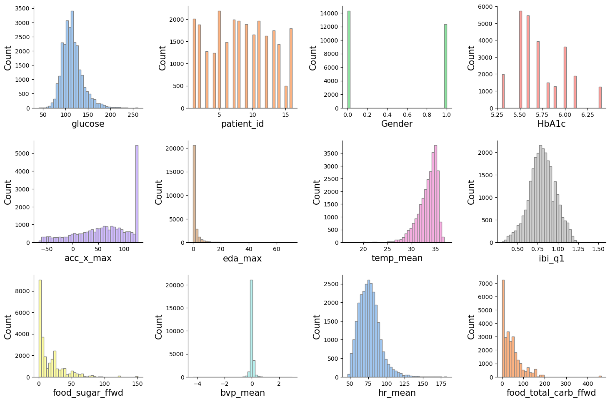
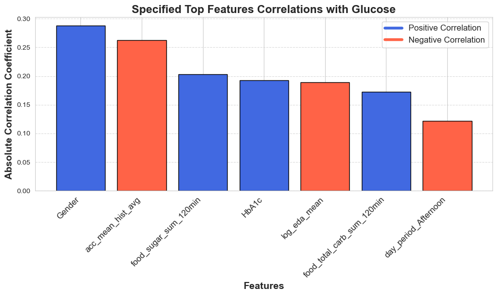
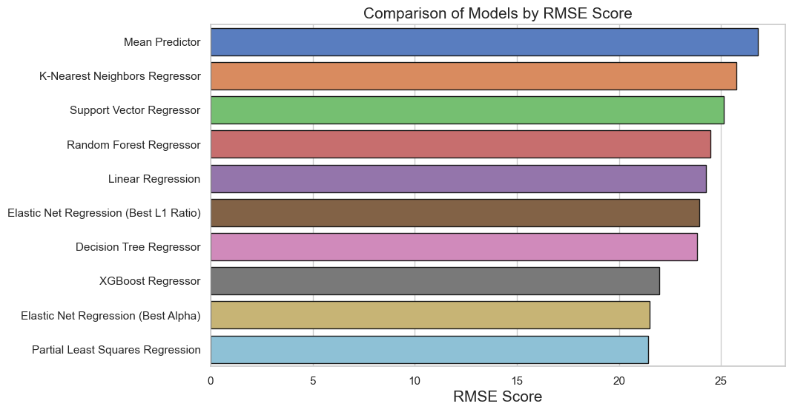
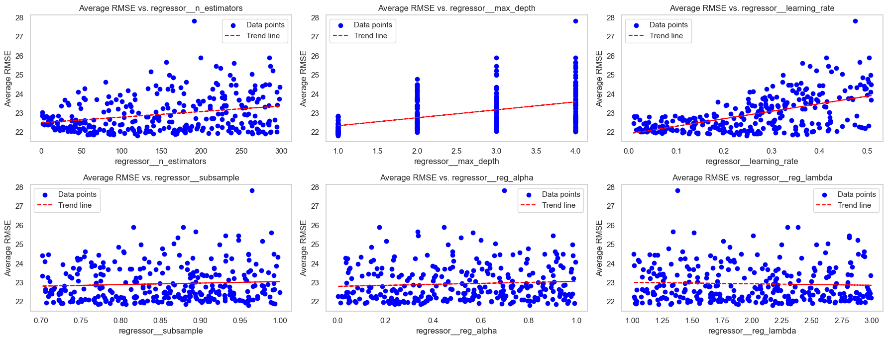
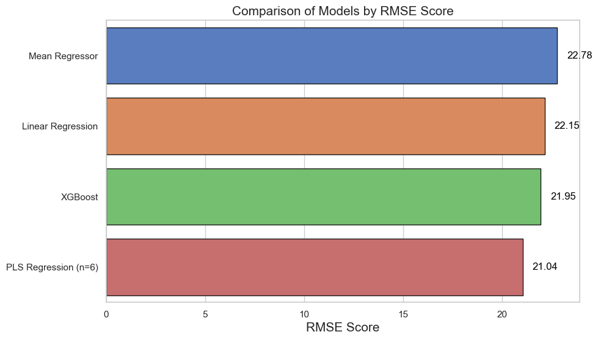
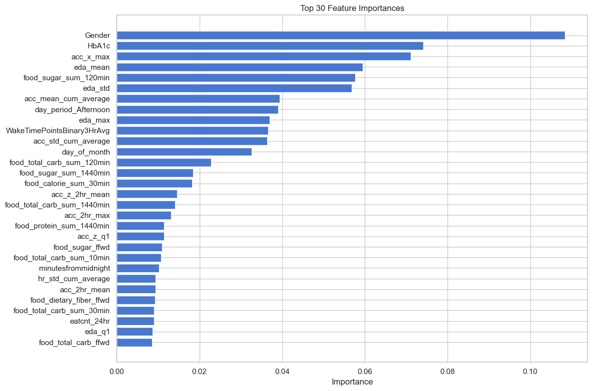
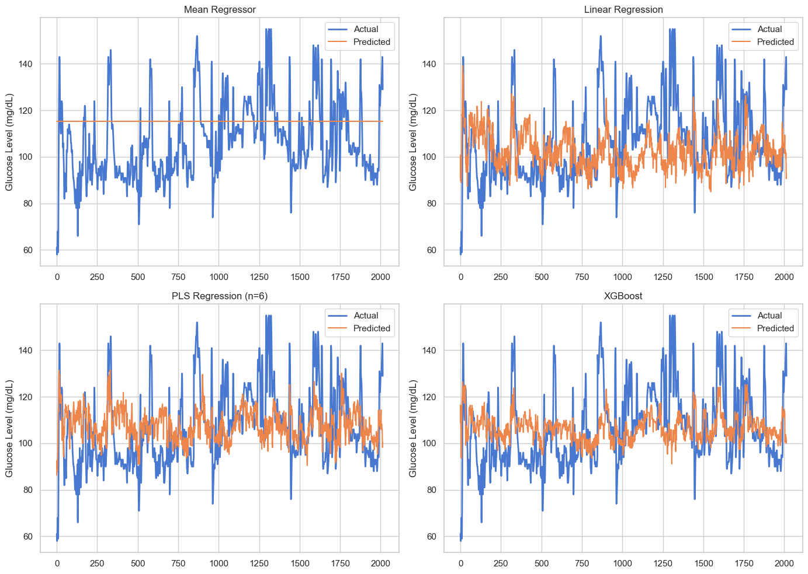
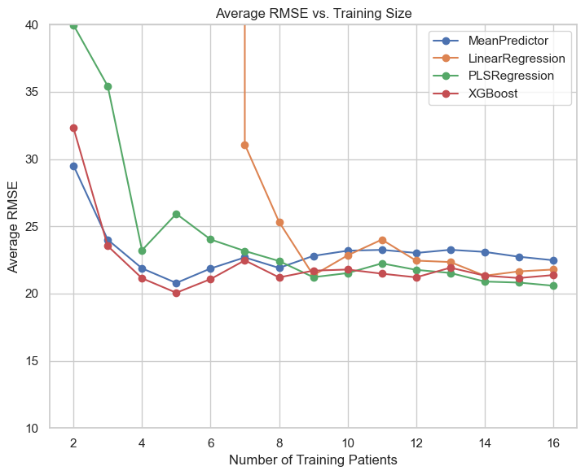

# GlucoPredict
*Prediabetes affects one in three people, with a 10% annual risk of progression to type 2 diabetes without intervention. Effective glycemic monitoring is crucial for prevention, yet no noninvasive, commercially available method exists for self-management. This study demonstrates the feasibility of using noninvasive methods, such as smartwatches and food logs, to monitor and predict glucose levels. Utilizing a dataset of 25,000 simultaneous glucose and smartwatch measurements, I developed a machine learning model that achieved a 13% Mean Absolute Percent Error in real-time glucose prediction.*

## 1. Data

This dataset is based on a study conducted at Duke University, and includes data from 16 participants monitored over 8-10 days using Dexcom G6 and Empatica E4 devices. It features over 25,000 interstitial glucose readings, along with PPG, EDA, skin temperature, heart rate, interbeat interval, and tri-axial accelerometry data, all stored in CSV files. Food logs and demographic details are also included. The data was collected under ethical approval from the Duke University Health System. For more details, including data files and usage notes, refer to the following links:

> * [Data Description](https://physionet.org/content/big-ideas-glycemic-wearable/1.1.2/001/#files-panel)
> * [Data Files](https://physionet.org/content/big-ideas-glycemic-wearable/1.1.2/001/#files-panel)
> * [Usage Notes](https://physionet.org/content/big-ideas-glycemic-wearable/1.1.2/001/#files-panel)

## 2. Method

This project aims to predict glucose levels using noninvasive wearable data. The process includes:

1. **Data Preprocessing**
   - **Dataset**: Over 25,000 glucose readings from Dexcom G6 and physiological data from Empatica E4, plus food logs.
   - **Tasks**: Clean, synchronize, and integrate the data for accuracy.

2. **Feature Engineering**
   - **Features**: Derived from wearables (PPG, EDA, heart rate, accelerometry) and dietary logs.
   - **Goal**: Convert raw data into inputs for modeling.

3. **Model Training**
   - **Models**: Various machine learning algorithms are trained to predict glucose levels.
   - **Metrics**: Evaluated using Root Mean Square Error (RMSE) and Mean Absolute Percent Error (MAPE).

4. **Real-Time Prediction**
   - **Application**: Provides what would be real-time glucose predictions based on current wearable and food log data.

5. **Evaluation**
   - **Validation**: Assessed through Leave-One-Group-Out cross-validation and error metrics.

For more details, see the project's [documentation](#) and [code](#).

## 3. Data Cleaning 

[Data Cleaning Report](#)

In this project, data cleaning and preprocessing were critical for ensuring the accuracy and consistency of the glucose monitoring dataset. Here’s a summary of the key steps and challenges addressed:

* **Patient-Specific Data Wrangling:**
  - **Issue:** Each patient's data required individual handling and integration. **Solution:** Loaded and cleaned data for each patient, added a Patient ID column, and merged with demographic information. Resampled each feature to 5-minute intervals along with glucose measurements. Applied universal wrangling code to ensure consistency across all patients and saved the final dataset as `patient_df.csv`.

* **Food Log Data Processing:**
  - **Issue:** Initial food log DataFrames required inspection and standardization. **Solution:** Fixed column names for inconsistencies across different patients. Concatenated all food logs into a single DataFrame, converted columns to appropriate data types, and saved the cleaned data as `food_df.csv`.

* **Wearable and Demographic Data Integration:**
  - **Issue:** Combining wearables and demographic data required careful alignment and preprocessing. **Solution:** Imported and preprocessed patient data, set the index to datetime, and encoded categorical data. Merged food log data with patient information, forward-filled missing instances, and adjusted column order for clarity. Saved the final DataFrame as `combined_df.csv`.

## 4. Exploratory Data Analysis (EDA)

[EDA Report](#)

In the EDA phase, we explored the dataset to understand its structure and key relationships:

* **Initial Inspection:**
  - Loaded `combined_df` and reviewed column names, data types, and sample sizes.

* **Missing Data and Correlations:**
  - Analyzed missing data and examined correlations with glucose.

* **Visualizations:**
  - **Histograms & Boxplots:** Visualized feature distributions.
  - **Correlation Matrix & Scatter Plots:** Explored feature relationships.
  - **Log Transformations:** Assessed improvements in glucose correlation.

* **Time Series Analysis:**
  - Plotted time series data for Patient 001.

* **Categorical Features:**
  - Added and encoded time-of-day categories (Night, Morning, Afternoon, Evening) and analyzed their correlations with glucose.

This analysis provided key insights into data patterns and feature relationships.

## 5. Feature Engineering

Feature engineering was key to improving glucose prediction. Key steps included:

* **Log Transformations:** Applied log transformations to enhance feature correlations with glucose.
* **Time-Based Features:** Added features for time since midnight, day of month, weekend status, and elapsed time.
* **Categorical Features:** Created and one-hot encoded day periods (Night, Morning, Afternoon, Evening).
* **Rolling Statistics:** Calculated accumulative sums and rolling statistics for dietary intake and activity bouts.
* **Additional Features:** Added rolling sum windows for meal counts, wake time calculations, and activity bout statistics.

These features were engineered to provide deeper insights and improve model accuracy.

## 6. Modeling Pipeline and Model Survey

### 6.1 Survey Model Pipeline

The modeling pipeline facilitates data preprocessing, model training, and evaluation. Key steps include:

- **Data Preparation**:
  - **Extracting Data**: The function `get_first_quarter_data()` is used to retrieve the first 25% of data for each patient.
  - **Data Splitting**: Training data comprises patients 3-16, with patient 2's first 25% reserved for testing.

- **Preprocessing**:
  - **Imputation and Scaling**: Missing values are imputed with the mean, and features are standardized using `StandardScaler`.

- **Model Evaluation**:
  - **Evaluation Function**: The `evaluate_model()` function trains models, generates predictions, and computes performance metrics such as MAE, RMSE, R2, and MAPE.
  - **Visualization**:
    - **Plotting Results**: The `plot_best_results()` function compares true and predicted values.
    - **RMSE Visualization**: The `plot_rmse_vs_parameter()` function plots RMSE against parameter values.

### 6.2 Model Survey

Models are assessed and compared based on various performance metrics:

- **Model Results**:
  - Results are gathered for each model, including Mean Predictor, Linear Regression, Elastic Net, Decision Tree, Random Forest, XGBoost, SVR, and KNN, and are stored in a results dictionary for comprehensive comparison.

## 7. Final Model Optimization

### Overview

Optimized both the PLS and XGBoost models using RandomizedSearchCV with Leave-One-Group-Out Cross-Validation (LOGO CV) to identify the best hyperparameters for glucose prediction.

### Key Steps

1. **Data Preparation**: Training data included patients 2-16, excluding patient 1.
2. **Pipeline**: Combined data imputation, scaling, and XGBoost regression.
3. **Hyperparameter Tuning**: Optimized parameters such as `n_estimators`, `max_depth`, and `learning_rate`.

### Results

- **Best Parameters**: Determined through RandomizedSearchCV.
- **Best RMSE**: PLS had the best RMSE using LOGO-CV and therefore should generalize best.

### Visualization

- **Hyperparameter Impact**: Plots illustrate the effect of different hyperparameters on RMSE.
- **Model Comparison**: Visualized RMSE for various models including Mean Regressor, Linear Regression, XGBoost, and PLS Regression (n=6).

## 8. Final Model Optimization

### Overview

Optimized PLS and XGBoost models using RandomizedSearchCV with Leave-One-Group-Out Cross-Validation (LOGO CV) for glucose prediction.

### Key Steps

1. **Data**: Training on patients 2-16, excluding patient 1.
2. **Pipeline**: Included data imputation, scaling, and regression.
3. **Tuning**: Sampled parameters like `n_estimators`, `max_depth`, and `learning_rate`.

### Results

- **Best RMSE**: PLS Regression (n=6) achieved the lowest RMSE of 21.04, indicating the best performance.

### Visualization

#### Feature Importance

This plot highlights the importance of various features in the XGBoost model, showing which variables have the most impact on glucose prediction.

#### Model Performance

This graph compares the performance of different models using RMSE, illustrating how each model fares in predicting glucose levels.

#### Adding More Patients

The results shown here demonstrate the effect of including additional patients on model performance, reflecting improvements in prediction accuracy at first but with diminishing returns.

## 9. Opportunities for Improvement

Future enhancements for the glucose prediction system could include:

1. **Expanded Dataset**: Incorporate data from a broader range of patients to enhance model generalization.
2. **Improved Food Logs**: Ensure more accurate and consistent tracking of food intake to better correlate with glucose levels.
3. **Incorporate Stress, Sleep, and Objective Sleep Data**: Add self-reported and wearable data on stress and sleep, including data from devices like Apple Watch for sleep schedules and O2 measurements.
4. **Include Environmental Factors**: Consider variables such as temperature and humidity that may impact glucose levels.
5. **Track Hydration Levels**: Monitor and incorporate hydration data into the prediction model.
6. **Advanced Features**: Capture and analyze rapid changes in glucose levels to improve prediction accuracy.

## 10. Credits

Special thanks to:
- **Shmuel Naaman** for guidance and mentorship throughout the project.

