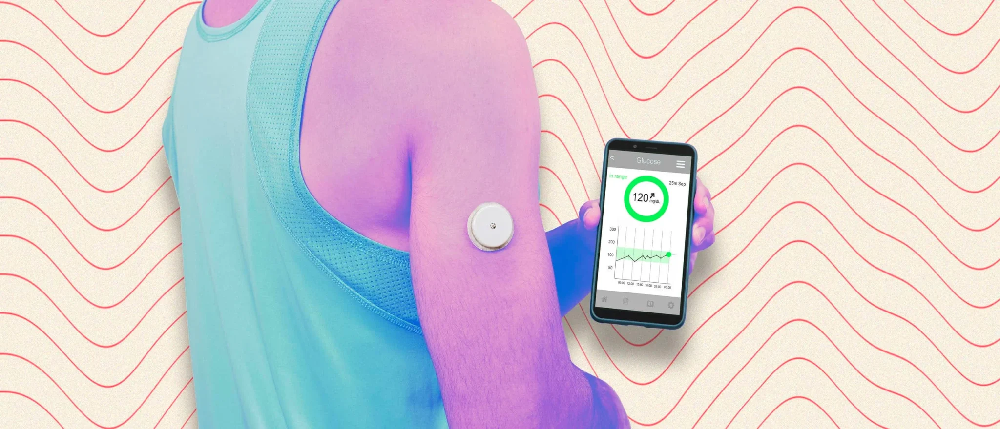

# GlucoPredict
*Prediabetes affects one in three people, with a 10% annual risk of progression to type 2 diabetes without intervention. Effective glycemic monitoring is crucial for prevention, yet no noninvasive, commercially available method exists for self-management. This study demonstrates the feasibility of using noninvasive methods, such as smartwatches and food logs, to monitor and predict glucose levels. Utilizing a dataset of 25,000 simultaneous glucose and smartwatch measurements, I developed a machine learning model that achieved a 13% Mean Absolute Percent Error in real-time glucose prediction.*
